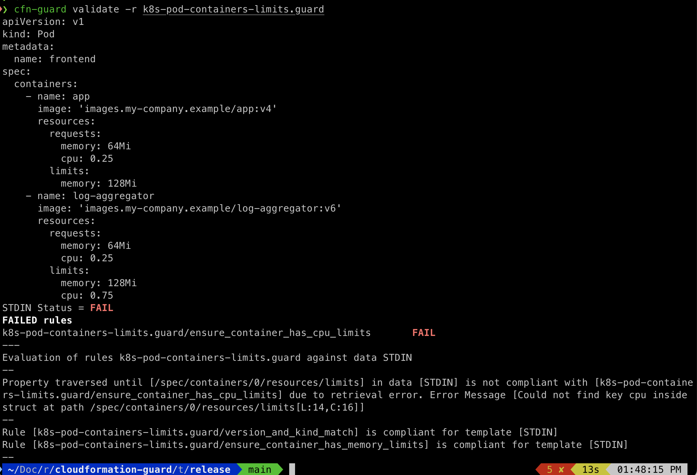
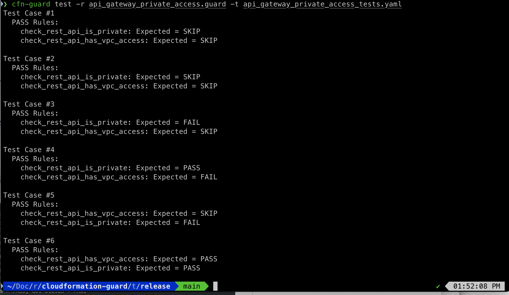

# AWS CloudFormation Guard

**Validate Cloud Environments with Policy-as-Code**

AWS CloudFormation Guard is an open-source general-purpose policy-as-code evaluation tool. It provides developers with a simple-to-use, yet powerful and expressive domain-specific language (DSL) to define policies and enables developers to validate JSON- or YAML- formatted structured data with those policies.

The Guard 3.0 release introduces support for stateful rules through built-in functions, SAM CLI as an alternative deployment method for `cfn-guard-lambda`, command auto-completions for shell, advanced regular expressions, improved handling of intrinsic functions for the test command, as well as the `--structured` flag to the validate command to emit JSON/YAML parseable output.  Note that previously written tests may have to be reviewed due to the corrected behavior of intrinsic function handling.  Please see the release notes for full details and examples.

Guard can be used for the following domains:

1. **Preventative Governance and Compliance (shift left):** validate Infrastructure-as-code (IaC) or infrastructure/service compositions such as CloudFormation Templates, CloudFormation ChangeSets, Terraform JSON configuration files, Kubernetes configurations, and more against Guard policies representing your organizational best practices for security, compliance, and more. For example, developers can use Guard policies with
    1. Terraform plan (**in JSON format**) for deployment safety assessment checks or Terraform state files to detect live state deviations.
    2. Static assessment of IaC templates to determine network reachability like Amazon Redshift cluster deployed inside a VPC and prevent the provision of such stacks.
2. **Detective Governance and Compliance:** validate conformity of Configuration Management Database (CMDB) resources such as AWS Config-based configuration items (CIs). For example, developers can use Guard policies against AWS Config CIs to continuously monitor state of deployed AWS and non-AWS resources, detect violations from policies, and trigger remediation.
3. **Deployment Safety:** validate CloudFormation ChangeSets to ensure changes are safe before deployment. For example, renaming an Amazon DynamoDB Table will cause a replacement of the Table. With Guard 3.0, you can prevent such changes in your CI/CD pipelines.

> **NOTE**: If you are using Guard 1.0 rules, we highly recommend adopting the latest version of Guard to simplify your current policy-as-code experience. Guard 2.0 and higher versions are backward incompatible with your Guard 1.0 rules and can result in breaking changes. The Guard 2.0 release was a complete re-write of the earlier 1.0 version to make the tool general-purpose.
>
> To migrate from Guard 1.0 rules to use the updated grammar, follow the steps given below.
> 1. Pull the release artifacts for the latest `2.x.x` release from the corresponding release page listed [here](https://github.com/aws-cloudformation/cloudformation-guard/releases).
> 2. Use `migrate` command to transition your existing 1.0 rules to use the updated grammar
> 3. Read about all new Guard features from the latest release, and modify your rules for enhanced experience


**Guard In Action**


**Customer Feedback**
Take this [survey](https://amazonmr.au1.qualtrics.com/jfe/form/SV_bpyzpfoYGGuuUl0) to provide feedback about cfn-guard

## Table of Contents

* [FAQs](#faqs)
* [Guard DSL](#guard-dsl)
  * [Tenets](#tenets)
  * [Features of Guard DSL](#features-of-guard-dsl)
* [Guard CLI](#guard-cli)
  * [Installation](#installation)
  * [How does Guard CLI work?](#how-does-guard-cli-work?)
* [Rule authoring references](#references)
* [Built-in functions & stateful rules](#functions)
* [AWS Rule Registry](#registry)
* [Use Guard as a Docker Image](#docker)
* [Use Guard as a CI tool](#ci)
* [License](#license)

## FAQs

**1) What is Guard?**
> Guard is an open-source command line interface (CLI) that provides developers a general purpose domain-specific language (DSL) to express policy-as-code and then validate their JSON- and YAML-formatted data against that code. Guard’s DSL is a simple, powerful, and expressive declarative language to define policies. It is built on the foundation of clauses, which are assertions that evaluate to `true` or `false`. Examples clauses can include simple validations like all Amazon Simple Storage Service (S3) buckets must have versioning enabled, or combined to express complex validations like preventing public network reachability of Amazon Redshift clusters placed in a subnet. Guard has support for looping, queries with filtering, cross query joins, single shot variable assignments, conditional executions, and composable rules. These features help developers to express simple and advanced policies for various domains.

**2) What Guard is not?**
> Guard **is not** a general-purpose programming language. It is a **purpose-built** DSL that is designed for policy definition and evaluation. Both non-technical people and developers can easily pick up Guard. Guard is human-readable and machine enforceable.

**3) Where can I use Guard?**
> You can use Guard to define any type of policy for evaluation. You can apply Guard in the context of multiple domains: a) validating IaC/service compositions such as [CloudFormation Templates](https://aws.amazon.com/cloudformation/resources/templates/), Terraform JSON configuration files, and Kubernetes configurations, b) verifying conformity of CMDB resources such as AWS Config-based CIs, and c) assessing security postures across resources like AWS Security Hub. The policy language and expression is common to all of them, based on simple Guard clauses.

**3) What is a clause in Guard?**
> Clause is an assertion that evaluates to true or false. Clauses can either use binary operations to compare two values (e.g `==, >` and `in`), or unary operations that takes only one value (e.g. `exists, empty,` and  `is_list`).  Here is a sample clause that compares `Type` to be a `AWS::S3::Bucket` :

```
Type == /AWS::S3::Bucket/
```

**4) What are the supported** **types** **that can I use to define clauses?**
> Guard supports all primitives `string, integer (64), float (64), bool, char, regex` and specialized range expression like `r(10, 200)`, for specifying ranges of values. It supports general key value pair maps (a.k.a associative arrays/struct) like `{ "my-map": { "nested-maps": [ { "key": 10, "value": 20 } ] } },` and arrays of primitives or key-value pair maps like `[10, 20, 30] or [{ Key: "MyApp", Value: "PROD}, ..]`.

**5) What binary and unary comparison operators can I use?**
> *Unary Operators:* `exists, empty, is_string, is_list, is_struct, is_bool, is_int, is_float, not(!)`
> *Binary Operators:* `==, !=, >, >=, <, <=, IN `
>
> Most operators are self-explanatory. A few important points:
>
> 1. Refer [Guard: Clauses](docs/CLAUSES.md) to understand the usage of `exists` and `empty` operators
> 2. Clause `ports >= [10, 20, 30]` implies that every element for `ports` is `>= 30`. If your intention is range, then express it as `r[10, 30]` .
> 3. Clause `ports >= 100` can have ports resolve to an array `[121, 200, 443]`. This check ensures that every element returned was >= 100, and in the example shown this evaluates to `true.`
> 4. `IN` operator for collections (does not work for `string` type) to check if any value matches. For example:

```
Properties.SslPolicy IN ["ELBSecurityPolicy-TLS-1-2-2017-01", "ELBSecurityPolicy-TLS-1-2-Ext-2018-06"]
```

**6) How can I define advanced policy rules?**
> You can define advanced policy rules using Conjunctive normal form. For example, here is a clause that asserts that all S3 buckets have a) names that start with a common prefix, b) encryption turned on, and c) only KMS-based algorithm is used (to know more about the query part read [Guard: Query and Filtering](docs/QUERY_AND_FILTERING.md)) for IaC template.

```
let s3_buckets = Resources.*[ Type == /S3::Bucket/ ]

# Skip the checks if there are no S3 buckets present
rule s3_bucket_name_encryption_check when %s3_buckets !empty {
    %s3_buckets {
        Properties {
             # common prefix
             BucketName == /^MyCompanyPrefix/

             # encryption MUST BE on
             BucketEncryption.ServerSideEncryptionConfiguration[*] {
                # only KMS
                ServerSideEncryptionByDefault.SSEAlgorithm IN
                    ["aws:KMS"]
             }
        }
    }
}
```

**7) Can I easily test policy rules?**
> Yes. Guard supports a built-in unit testing framework to test policy rules and clauses. This gives customers confidence that their guard policy rules work as intended. You can learn more about this unit testing framework in this doc [Guard: Unit Testing](docs/UNIT_TESTING.md)

**8)** **Does Guard support rule categories?**
> Yes. Guard supports running several rule-sets together for validating policies. You can create multiple rule files, each with its own intended purpose. For example, you can create one rules file for S3, second one for Dynamo DB, third one for access management, and so on. Alternatively, you can create a rules file for all your security related rules, second one for cost compliance, and so on. You can run Guard against all these rule files at once for evaluation. Refer example rules file [Guard: Clauses](docs/CLAUSES.md), [Guard: Complex Composition](docs/COMPLEX_COMPOSITION.md).

**9) Where can I evaluate Guard policies?**
> Guard supports the entire spectrum of end-to-end evaluation of policy checks. The tool supports bringing in shift-left practices as close as running it directly at development time, integrated into code repositories via hooks like GitHub Actions for pull requests, and into CI/CD pipelines such as AWS CodePipeline pipelines and Jenkins (just exec process).

**10) What are you not telling me? This sounds too good to be true.**
> Guard is a DSL and an accompanying CLI tool that allows easy-to-use definitions for declaring and enforcing policies. Today the tool supports local file-based execution of a category of policies. Guard doesn’t support the following things today, along with workarounds for some:
>
> 1. Sourcing of rules from external locations such as GitHub Release and S3 bucket. If you want this feature natively in Guard, please raise an issue or +1 an existing issue.
> 2. Ability to import Guard policy file by reference (local file or GitHub, S3, etc.). It currently only supports a directory on disk of policy files, that it would execute.
> 3. Parameter/Vault resolution for IaC tools such as CloudFormation or Terraform. Before you ask, the answer is NO. We will not add native support in Guard as the engine is general-purpose. If you need CloudFormation resolution support, raise an issue and we might have a solution for you. We do not support HCL natively. We do, however, support Terraform Plan in JSON to run policies against for deployment safety. If you need HCL support, raise an issue as well.
> 4. Ability to reference variables like `%s3_buckets`, inside error messages. Both JSON/Console output for evaluation results contain some of this information for inference. We also do not support using variable references to create dynamic regex expressions. However, we support variable references inside queries for cross join support, like `Resources.%references.Properties.Tags`.
> 5. Support for specifying variable names when accessing map or list elements to cature these values. For example, consider this check `Resources[resource_name].Properties.Tags not empty`, here `resource_name` captures the key or index value. The information is tracked as a part of the evaluation context today and  present in both console/JSON outputs. This support will be extended to regex expression variable captures as well.
> 6. There are [known issues](docs/KNOWN_ISSUES.md) with potential workarounds that we are tracking towards resolution

**11) What are we really thankful about?**
> Where do we start? Hmm.... we want to thank Rust [language’s forums](https://users.rust-lang.org/), [build management, and amazing ecosystem](https://crates.io/) without which none of this would have been possible. We are not the greatest Rust practitioners, so if we did something that is not idiomatic Rust, please raise a PR.
>
> We want to make a special mention to [nom](https://github.com/Geal/nom) combinator parser framework to write our language parser in. This was an excellent decision that improved readability, testability, and composition. We highly recommend it. There are some rough edges, but it’s just a wonderful, awesome library. Thank you. Apart from that, we are consumers of many crates including [hyper](https://crates.io/crates/hyper) for HTTP handling, [simple logger](https://crates.io/crates/simple_logger), and many more. We also want to thank the open-source community for sharing their feedback with us through GitHub issues/PRs.
>
> And of course AWS for supporting the development and commitment to this project. Now read the docs and take it for a ride and tell us anything and everything.

## Guard DSL

### Tenets

**(Unless you know better ones)**

These tenets help guide the development of the Guard DSL:

* **Simple**: The language must be simple for customers to author policy rules, simple to integrate with an integrated development environment (IDE), readable for human comprehension, and machine enforceable.

* **Unambiguous**: The language must not allow for ambiguous interpretations that make it hard for customers to comprehend the policy evaluation. The tool is targeted for security and compliance related attestations that need the auditor to consistently and unambiguously understand rules and their evaluations.

* **Deterministic**: The language design must allow language implementations to have deterministic, consistent, and isolated evaluations. Results for repeated evaluations for the same context and rules must evaluate to the same result every time. Time to evaluate results inside near-identical environments must be within acceptable tolerance limits.

* **Composable**: The language must support composition to help build higher order functionality such as checks for PCI compliance, by easily combining building blocks together. Composition should not increase the complexity for interpreting outcomes, syntax, or navigation.

### Features of Guard DSL

* **Clauses:** Provides the foundational underpinning for Guard. They are assertions that evaluate to true or false. You can combine clauses using [Conjunctive Normal Form](https://en.wikipedia.org/wiki/Conjunctive_normal_form). You can use them for direct assertions, as part of filters to select values, or for conditional evaluations. To learn more read [Guard: Clauses](docs/CLAUSES.md)

* **Context-Aware Evaluations, `this` binding and Loops:** Automatic binding for context values when traversing hierarchical data with support for implicit looping over collections with an easy-to-use syntax. Collections can arise from accessing an array of elements, values for a map along with a filter, or from a query. To learn more read [Guard: Context-Aware Evaluations, this and Loops](docs/CONTEXTAWARE_EVALUATIONS_AND_LOOPS.md)

* **Query & Filtering:** Queries support simple decimal dotted format syntax to access properties in the hierarchical data. Arrays/Collections are accessed using `[]` . Map or Struct’s values can use `*` for accessing values for all keys. All collections can be further narrowed to target specific instances inside the collection using filtering. To learn more read [Guard: Query and Filtering](docs/QUERY_AND_FILTERING.md)

* **Variables, Projections, and Query Interpolation:** Guard supports single shot assignment to variables using a **`let`** keyword for assignment. All variable assignments resulting from a query is a list (result set). One can also assign static literals to variables. Variables are assessed using a prefix **`%`** and can be used inside the Query for interpolation. To learn more read [Guard: Query, Projection and Interpolation](docs/QUERY_PROJECTION_AND_INTERPOLATION.md)

* **Complex Composition**: As stated earlier, clauses can be expressed in Conjunctive Normal Form. Clauses on separates lines are ANDs. Disjunctions are expressed using the `or|OR` keyword. You can group clauses in a named rule. You can then use named rules in other rules to create more advanced compositions. Furthermore, you can have multiple files containing named rules that together form a category of checks for a specific compliance like “ensure encryption at rest”. To learn more read [Guard: Complex Composition](docs/COMPLEX_COMPOSITION.md)

## Guard CLI

### Installation

#### Installation from Pre-Built Release Binaries

##### MacOS

By default this is built for macOS-12 (Monterey). See [OS Matrix](https://docs.github.com/en/actions/reference/workflow-syntax-for-github-actions#github-hosted-runners)

1. Open terminal of your choice. Default `Cmd+Space`, type `terminal`
2. Cut-n-paste the commands below (change version=X for other versions)
```bash
$ curl --proto '=https' --tlsv1.2 -sSf https://raw.githubusercontent.com/aws-cloudformation/cloudformation-guard/main/install-guard.sh | sh
```
Remember to add `~/.guard/bin/` to your `$PATH`.

Alternatively, you can install the latest version with [Homebrew](https://brew.sh/).

```bash
$ brew install cloudformation-guard
```

You would not need to modify `$PATH` this way.

##### Ubuntu

1. Open any terminal of your choice
2. Cut-n-paste the commands below (change version=X for other versions)
```bash
$ curl --proto '=https' --tlsv1.2 -sSf https://raw.githubusercontent.com/aws-cloudformation/cloudformation-guard/main/install-guard.sh | sh
```

Remember to add `~/.guard/bin/` to your `$PATH`.

##### Windows

1. Open PowerShell as Administrator
2. Cut-n-paste the command below
```shell
$GuardWindowsInstallScript = Invoke-WebRequest https://raw.githubusercontent.com/aws-cloudformation/cloudformation-guard/main/install-guard.ps1; Invoke-Expression $($GuardWindowsInstallScript.Content)
```

If you get an error regarding authorization to execute the script run the follow before retrying step 2:

```shell
Set-ExecutionPolicy -Scope Process -ExecutionPolicy Bypass
```

#### Installation of Rust and Cargo

##### Ubuntu/MacOS: Install Rust and Cargo

```bash
$ curl --proto '=https' --tlsv1.2 -sSf https://sh.rustup.rs | sh
```

If you have not already, run `source $HOME/.cargo/env` as recommended by the rust installer. Read [here](https://rustup.rs/) for more information.

If building on `Ubuntu`, it is recommended to run `sudo apt-get update; sudo apt install build-essential`.

##### Windows 10: Install Rust and Cargo

1. Create a Windows 10 workspace.
2. Install the version of Microsoft Visual C++ Build Tools 2019 which provides just the Visual C++ build tools: https://visualstudio.microsoft.com/downloads/#build-tools-for-visual-studio-2019.
3. Download the installer and run it.
4. Select the "Individual Components" tab and check "Windows 10 SDK".
5. Select the "Language Packs" tab and make sure that at least "English" is selected.
6. Click "Install".
7. Let it download and reboot if asked.
8. Install [Rust](https://forge.rust-lang.org/infra/other-installation-methods.html#other-ways-to-install-rustup).
9. Download [rust-init.exe](https://static.rust-lang.org/rustup/dist/i686-pc-windows-gnu/rustup-init.exe).
10. Run it and accept the defaults.

#### Cargo-based Installation
Now that you have [rust and cargo installed](https://doc.rust-lang.org/cargo/getting-started/installation.html), installation of cfn-guard is easy:

```bash
$ cargo install cfn-guard
```

Check `help` to see if it is working.

```bash
$ cfn-guard help
cfn-guard 3.1.1

  Guard is a general-purpose tool that provides a simple declarative syntax to define
  policy-as-code as rules to validate against any structured hierarchical data (like JSON/YAML).
  Rules are composed of clauses expressed using Conjunctive Normal Form
  (fancy way of saying it is a logical AND of OR clauses). Guard has deep
  integration with CloudFormation templates for evaluation but is a general tool
  that equally works for any JSON- and YAML- data.

Usage: cfn-guard [COMMAND]

Commands:
  parse-tree   Prints out the parse tree for the rules defined in the file.
  test         Built in unit testing capability to validate a Guard rules file against
               unit tests specified in YAML format to determine each individual rule's success
               or failure testing.

  validate     Evaluates rules against the data files to determine success or failure.
               You can point rules flag to a rules directory and point data flag to a data directory.
               When pointed to a directory it will read all rules in the directory file and evaluate
               them against the data files found in the directory. The command can also point to a
               single file and it would work as well.
               Note - When pointing the command to a directory, the directory may not contain a mix of
               rules and data files. The directory being pointed to must contain only data files,
               or rules files.

  rulegen      Autogenerate rules from an existing JSON- or YAML- formatted data. (Currently works with only CloudFormation templates)
  completions  Generate auto-completions for all the sub-commands in shell.
  help         Print this message or the help of the given subcommand(s)

Options:
  -h, --help     Print help
  -V, --version  Print version

```

### How does Guard CLI work?

The two common Guard CLI commands are `validate` and `test`.

#### Validate

Validate command is used when you need to assess the compliance or security posture as defined by a set of policy files against incoming JSON/YAML data. Common data payloads used are CloudFormation Templates, CloudFormation ChangeSets, Kubernetes Pod policies, Terraform Plan/Configuration in JSON format, and more. Here is an example run of the `validate` command for assessing Kubernetes Pod Container configurations

1. Save the sample policy rules file below as `k8s-pod-containers-limits.guard`:

```
#
# Kubernetes container based limit checks
#

#
# These set of rules primarily apply to the version 1 of the API spec (including v1Beta) and
# the kind of document is a 'Pod'
#
rule version_and_kind_match
{
    apiVersion == /v1/
    kind == 'Pod'
}

#
# For the 'Pod' document ensure that containers have resource limits set
# for memory
#
rule ensure_container_has_memory_limits when version_and_kind_match
{
    spec.containers[*]
    {
       resources.limits
       {
            #
            # Ensure that memory attribute is set
            #
            memory exists
            <<
                Id: K8S_REC_22
                Description: Memory limit must be set for the container
            >>
        }
   }

}

#
# For the 'Pod' document ensure that containers have resource limits set
# for cpu
#
rule ensure_container_has_cpu_limits when version_and_kind_match
{
    spec.containers[*]
    {
       resources.limits
       {
            #
            # Ensure that cpu attribute is set
            #
            cpu exists
            <<
                Id: K8S_REC_24
                Description: Cpu limit must be set for the container
            >>
       }
   }
}
```

2. Paste the command below and hit `enter`

```bash
cfn-guard validate -r k8s-pod-containers-limits.guard
```

3. Cut-n-paste the sample configuration below for k8s pods on STDIN and then hit `CTRL+D`:

```yaml
apiVersion: v1
kind: Pod
metadata:
  name: frontend
spec:
  containers:
    - name: app
      image: 'images.my-company.example/app:v4'
      resources:
        requests:
          memory: 64Mi
          cpu: 0.25
        limits:
          memory: 128Mi
    - name: log-aggregator
      image: 'images.my-company.example/log-aggregator:v6'
      resources:
        requests:
          memory: 64Mi
          cpu: 0.25
        limits:
          memory: 128Mi
          cpu: 0.75
```



The container `app` does not contain CPU limits specified, which fails the overall evaluation as shown in the screenshot.

#### Test

Test command is used during the development of guard policy rules files. Test provides a simple integrated unit-test frameworks that allows authors to individually test each policy file for different types of inputs. Unit testing helps authors gain confidence that the rule does indeed conform to expectations. It can also be used as regression tests for rules. Here is example run for `test` command

1. Save the sample policy rules file below as `api_gateway_private_access.guard`:

```
#
# Select from Resources section of the template all ApiGateway resources
# present in the template.
#
let api_gws = Resources.*[ Type == 'AWS::ApiGateway::RestApi' ]

#
# Rule intent
# a) All ApiGateway instances deployed must be private
# b) All ApiGateway instances must have atleast one IAM policy condition key to allow access from a VPC
#
# Expectations:
# 1) SKIP when there are not API Gateway instances in the template
# 2) PASS when ALL ApiGateway instances MUST be "PRIVATE" and
#              ALL ApiGateway instances MUST have one IAM Condition key with aws:sourceVpc or aws:SourceVpc
# 3) FAIL otherwise
#
#

rule check_rest_api_is_private when %api_gws !empty {
  %api_gws {
    Properties.EndpointConfiguration.Types[*] == "PRIVATE"
  }
}

rule check_rest_api_has_vpc_access when check_rest_api_is_private {
  %api_gws {
    Properties {
      #
      # ALL ApiGateways must have atleast one IAM statement that has Condition keys with
      #     aws:sourceVpc
      #
      some Policy.Statement[*] {
        Condition.*[ keys == /aws:[sS]ource(Vpc|VPC|Vpce|VPCE)/ ] !empty
      }
    }
  }
}
```

2. Save the sample test file below as `api_gateway_private_access_tests.yaml`:

```yaml
---
- input: {}
  expectations:
    rules:
      check_rest_api_is_private: SKIP
      check_rest_api_has_vpc_access: SKIP
- input:
     Resources: {}
  expectations:
    rules:
      check_rest_api_is_private: SKIP
      check_rest_api_has_vpc_access: SKIP
- input:
    Resources:
      apiGw:
        Type: AWS::ApiGateway::RestApi
  expectations:
    rules:
      check_rest_api_is_private: FAIL
      check_rest_api_has_vpc_access: SKIP
- input:
    Resources:
      apiGw:
        Type: AWS::ApiGateway::RestApi
        Properties:
          EndpointConfiguration:
            Types: PRIVATE
  expectations:
    rules:
      check_rest_api_is_private: PASS
      check_rest_api_has_vpc_access: FAIL
- input:
    Resources:
      apiGw:
        Type: AWS::ApiGateway::RestApi
        Properties:
          EndpointConfiguration:
            Types: [PRIVATE, REGIONAL]
  expectations:
    rules:
      check_rest_api_is_private: FAIL
      check_rest_api_has_vpc_access: SKIP
- input:
    Resources:
      apiGw:
        Type: AWS::ApiGateway::RestApi
        Properties:
          EndpointConfiguration:
            Types: PRIVATE
          Policy:
            Statement:
              - Action: Allow
                Resource: '*'
                Condition:
                  StringLike:
                    'aws:sourceVPC': vpc-12345678
  expectations:
    rules:
      check_rest_api_is_private: PASS
      check_rest_api_has_vpc_access: PASS
```

3. Run the test command

```bash
cfn-guard test -r api_gateway_private_access.guard -t api_gateway_private_access_tests.yaml
```



Read [Guard: Unit Testing](docs/UNIT_TESTING.md) for more information on unit testing. To know about other commands read the [Readme in the guard directory](guard/README.md).

## <a name="references"></a> Rule authoring references

As a starting point for writing Guard rules for yourself or your organisation we recommend following [this official guide](https://docs.aws.amazon.com/cfn-guard/latest/ug/writing-rules.html)

### Quick links:

[Writing AWS CloudFormation Guard rules](https://docs.aws.amazon.com/cfn-guard/latest/ug/writing-rules.html)
1. [Clauses](https://docs.aws.amazon.com/cfn-guard/latest/ug/writing-rules.html#clauses)
2. [Using queries in clauses](https://docs.aws.amazon.com/cfn-guard/latest/ug/writing-rules.html#clauses-queries)
3. [Using operators in clauses](https://docs.aws.amazon.com/cfn-guard/latest/ug/writing-rules.html#clauses-operators)
4. [Using custom messages in clauses](https://docs.aws.amazon.com/cfn-guard/latest/ug/writing-rules.html#clauses-custom-messages)
5. [Combining clauses](https://docs.aws.amazon.com/cfn-guard/latest/ug/writing-rules.html#combining-clauses)
6. [Using blocks with Guard rules](https://docs.aws.amazon.com/cfn-guard/latest/ug/writing-rules.html#blocks)
7. [Defining queries and filtering](https://docs.aws.amazon.com/cfn-guard/latest/ug/query-and-filtering.html)
8. [Assigning and referencing variables in AWS CloudFormation Guard rules](https://docs.aws.amazon.com/cfn-guard/latest/ug/variables.html)
9. [Composing named-rule blocks in AWS CloudFormation Guard](https://docs.aws.amazon.com/cfn-guard/latest/ug/named-rule-block-composition.html)
10. [Writing clauses to perform context-aware evaluations](https://docs.aws.amazon.com/cfn-guard/latest/ug/context-aware-evaluations.html)

## <a name="functions"></a> Built-in functions & stateful rules

Guard 3.0 introduces support for functions, allowing for stateful rules that can run on a value that's evaluated based
on some properties extracted out of a data template.

### Sample template

Imagine we have a property in our template which consists of a list called as `Collection` and we need to ensure
it has at least 3 items in it.

```yaml
Resources:
  newServer:
    Type: AWS::New::Service
    Collection:
      - a
      - b
```
### Sample rule

We can write a rule to check this condition as follows:

```
let server = Resources.*[ Type == 'AWS::New::Service' ]
rule COUNT_CHECK when %server !empty {
    let collection = %server.Collection.*
    let count_of_items = count(%collection)
    %count_of_items >= 3
    <<
      Violation: Collection should contain at least 3 items
    >>
}
```

Expected outcome is that rule fails showing us the violation message since our template is non-compliant.

For detailed documentation regarding all supported functions, please [follow this link](./docs/FUNCTIONS.md). For limitations of functions usage, please read [this note](./docs/KNOWN_ISSUES.md#function-limitation).

## <a name="registry"></a> AWS Rule Registry

As a reference for Guard rules and rule-sets that contain (on a best-effort basis) the compliance policies that adhere
to the industry best practices around usages across AWS resources, we have recently launched
[AWS Guard Rules Registry](https://github.com/aws-cloudformation/aws-guard-rules-registry).


## <a name="docker"></a> Use Guard as a Docker Image

Guard is also published as an ECR image in [ECR public gallery](https://gallery.ecr.aws/aws-cloudformation/cloudformation-guard) and can be used as an image in a docker container.

### Prerequisites

1. Install docker. Follow [this guide](https://docs.docker.com/engine/install/).
1. Have a directory ready on the host you are downloading the docker image to that contains data templates and Guard rules you are planning to use, we may mount this directory and use the files as input to `cfn-guard`. We'll refer this directory to be called `guard-files` in the rest of this guide

### Usage Guide

To use the binary, we should pull the latest docker image, we may do so using the following command:
```bash
docker pull public.ecr.aws/aws-cloudformation/cloudformation-guard:latest
```
Now go ahead and run the docker image, using the files from directory we have our templates and rules file in, using:
```bash
docker run \
  --mount src=/path/to/guard-files,target=/container/guard-files,type=bind \
  -it public.ecr.aws/aws-cloudformation/cloudformation-guard:latest \
  ./cfn-guard validate -d /container/guard-files/template.yml -r /container/guard-files/rule.guard
```
We should see the evaluation result emitted out on the console.

## <a name="ci"></a> Use Guard as a CI tool

Guard is great for CI checks with the Junit output format, making the process of validating or testing your templates seamless and simple. Check out the examples below.

### GitHub Actions

#### Junit


[Get the template here!](https://github.com/aws-cloudformation/cloudformation-guard/tree/main/guard-examples/ci/.github/workflows/junit-test-and-validate.yml)

#### SARIF


[Get the template here!](https://github.com/aws-cloudformation/cloudformation-guard/tree/main/guard-examples/ci/.github/workflows/sarif-validate.yml)

### CircleCI

#### Junit


[Get the template here!](https://github.com/aws-cloudformation/cloudformation-guard/tree/main/guard-examples/ci/.circleci/config.yml)

### Tagging convention

* We use the tag `latest` for the most recent docker image that gets published in sync with `main` branch of the `cloudformation-guard` GitHub repository.
* We use the convention `<branch_name>.<github_shorthand_commit_hash>` for tags of historical docker images

## License

This project is licensed under the Apache-2.0 License.
